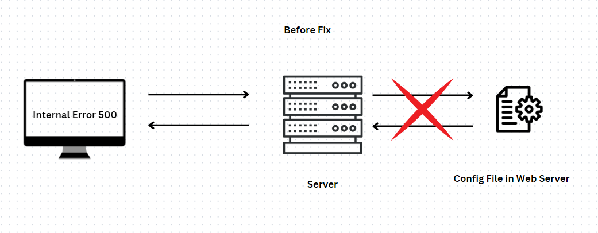
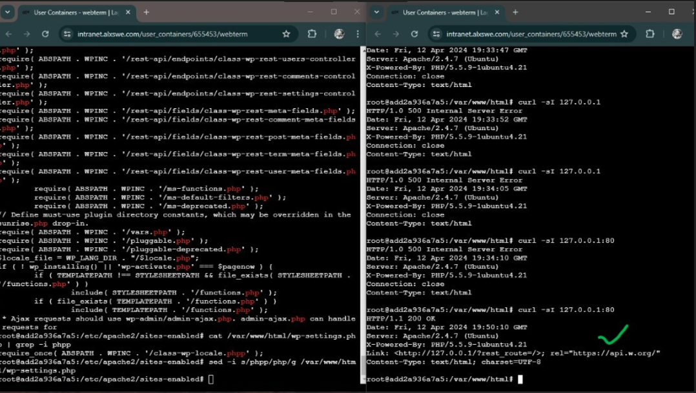
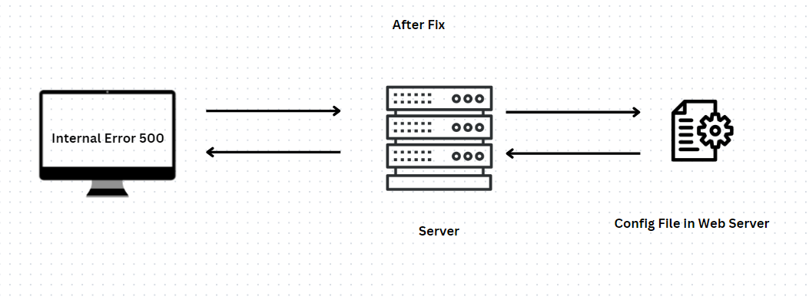

## POSTMORTEM REPORT

> Incident Overview
# Title:
Unexpected Internal Server Error

# Date 📅:
April 11, 2024

# Duration ⏲:
4 hours (18:28 - 22:28 UTC)

# Impact ⚡:
The company loss approximately 2,000 users of the its app and website.

# Report Prepared By ✍:
Wiseman Umanah, the Lead Software Engineer

# Summary of Incident 📝:
Around the eighteenth hour of the company website and other related apps were done, this was due to the an internal server error known by the status code 5xx on April 11, 2024. The service was fully restored by 22:28 UTC. Preliminary investigations point to a failure in the server due to a wrong file name inclusion.

# Timeline Of Event ⌛
- Incident Detection 🕵️‍♀️
  
18:28 UTC - Monitoring tools detect an unusually high rate of 500 errors in the server logs. An alert is automatically sent to the on-call system administrator and development team.

18:35 UTC - The first response team acknowledges the alert and begins initial assessment.

- Initial Assessment 🐞
  
19:10 UTC - The system administrator checks server health, resource usage (CPU, memory, disk I/O), and network connectivity to rule out infrastructure issues.

19:15 UTC - The development team reviews recent changes to the application, including any deployments that might have occurred just before the issue was reported.

- Issue Identification

19:40 UTC - Upon reviewing the files included, the team identifies a .php file inclusion with a wrong extension of .phpp in the configuration file

20:00 UTC - To reduce impact on the user experience, the configuration file was fixed immediately for a particular server.

20:15 UTC - The rate of 500 errors significantly drops.

- Root Cause Analysis

20:30 UTC - Developers pinpoint the bug to a poorly handled configuration file. Lack of adequate testing for this edge case is identified as a contributing factor.

21:00 UTC - A hotfix is developed using puppet for other servers, tested in a staging environment, and prepared for deployment.

- Resolution and Monitoring 🔎

21:45 UTC - The hotfix is deployed to production.
  
22:00 UTC - System monitoring shows a return to normal error rates and server performance.

22:28 UTC - The operations team sends out a communication to users and stakeholders explaining the issue and the steps taken to resolve it.

- Post-Incident Review ✔
  
Next day, 10:00 UTC - A postmortem meeting is held to discuss the incident. Key topics include the initial cause of the errors, the effectiveness of the response, and measures to prevent similar issues.

Next day, 11:00 UTC - Recommendations are made to improve error handling in the application, enhance monitoring capabilities, and increase coverage of automated tests to include the identified edge cases.

# Corrective and Preventive Measures:
> Immediate Remediation:
- Immediate checks using strace tools and checking server configuration file.

> Short-term Improvements:
- Connecting to the server and manually checking config files.

> Long-term Improvements:
- Automating tasks by writing a Puppet file that can be deployed to manage all servers from the short-term improvement.

# Conculsion
This incident has highlighted significant weaknesses in our application's error handling and deployment practices. The occurrence of widespread 5xx errors underlines the need for robust configuration file  management and fault tolerance within our system architecture.

# Recommendation for Future Incidents
- Regular reviews of configuration files and files added to make sure everything in the file system is intact.
- Improve monitoring tools to detect potential server and similar errors. Continuous monitoring by teams. 
- Allocating simple task to teams to check and implement rigorous testing on servers.

# Diagrammatic Respresentation of Issue

> Before Fix 

> During Bug Fixing 

> After Fix

